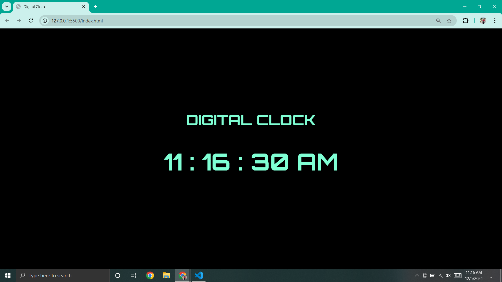
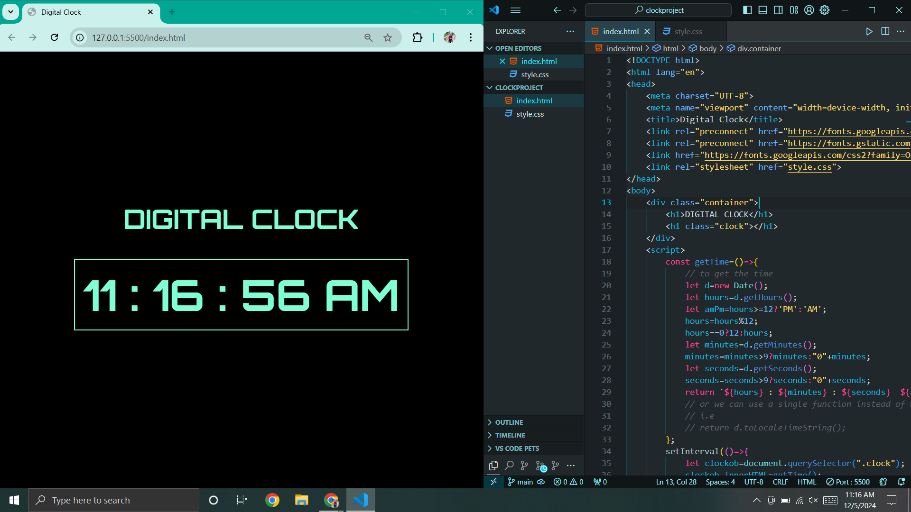

# Digital Clock
A simple **Digital Clock** built using **HTML**, **CSS**, and **JavaScript**. This project displays the current time in a 12-hour format with AM/PM indication, updated every second. The project was created to understand and experiment with basic JavaScript concepts like  `setInterval` and handling real-time updates in web applications.

## Screenshots
### Screenshot 1:


### Screenshot 2:


## Features
- Real-time clock display in **12-hour format** with **AM/PM**.
- Stylish design with **aquamarine** text and borders.
- Updates every second.
- Built with basic web technologies: **HTML**, **CSS**, and **JavaScript**.
- **Responsive design** that adjusts to various screen sizes.

## How to Use
1. Clone the repository to your local machine:
   ```bash
   git clone https://github.com/Aastha-Bhatia/Digital-Clock.git
   
## License
This project is licensed under the MIT License - see the LICENSE file for details.

## Project Setup
To view the project locally, follow these steps:

1. Clone the repository:
   ```bash
   git clone https://github.com/Aastha-Bhatia/Digital-Clock.git
2. Open the index.html file in your browser. Since it's a static HTML project, you don't need any server setup.

## How to Contribute

If you'd like to contribute to this project, please follow these steps:

1. Fork this repository.
2. Create a new branch for your feature:
   ```bash
   git checkout -b new-feature
